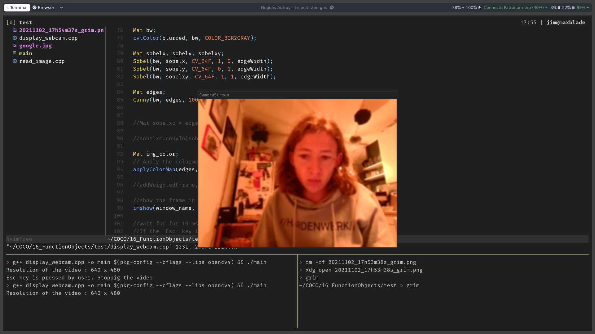
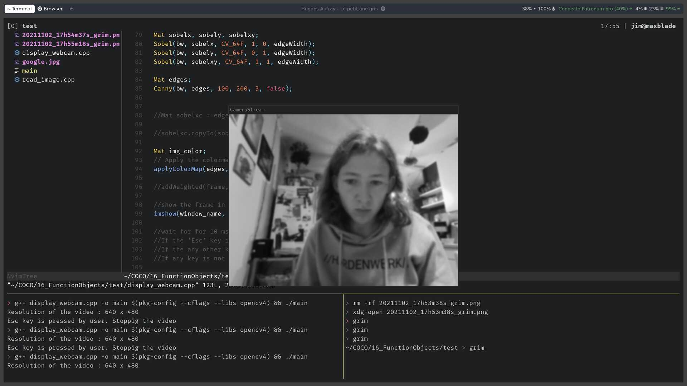
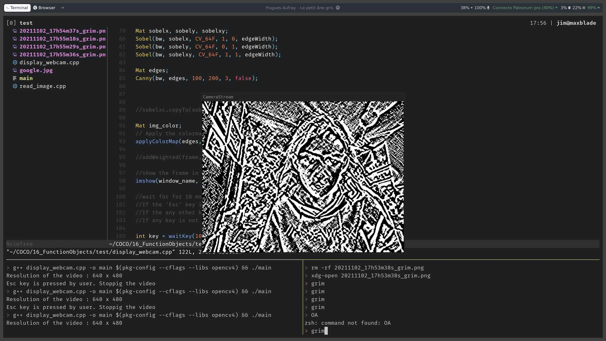
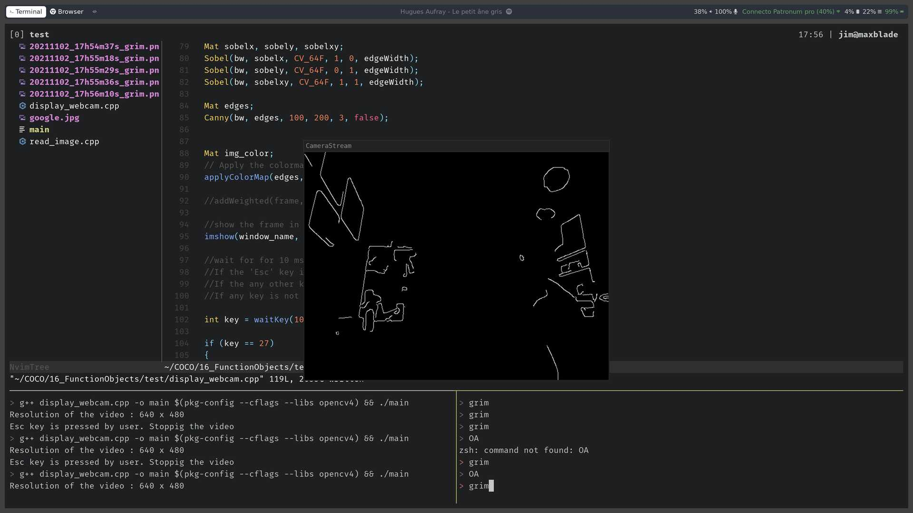
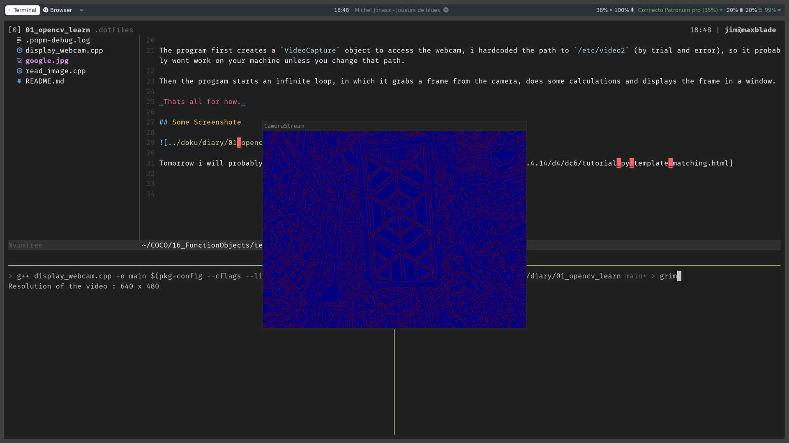

# Evaluation/Learning OpenCV

## Day 1

Because I never wrote or compiled any c++ code myself, there was some setting up to do.

**1: Installing a c++ compiler.**

For me g++ was already installed on my system so i did not have to do anything else

**2: Installing OpenCV**

Because i wanted to learn a bit, i compiled opencv myself, by following [this tutorial](https://linuxize.com/post/how-to-install-opencv-on-ubuntu-18-04/).

There is also a tutorial on the opencv website for [how to install opencv](https://docs.opencv.org/master/d0/d3d/tutorial_general_install.html)

Then i started writing my first program, `read_image.cpp`. (Actually i did not write any code myself, and just stole some from the internet, but dont tell anyone). I was a bit surprised, because i expected c++ code to be way harder to read and think about. But it looks a lot like good ol' javascript.

Because my endgoal is to write a program which is able to detect custom shapes, i knew i had to access my webcam, so this is where the second program comes into play `display_webcam.cpp`.

The program first creates a `VideoCapture` object to access the webcam, i hardcoded the path to `/etc/video2` (by trial and error), so it probably wont work on your machine unless you change that path.

Then the program starts an infinite loop, in which it grabs a frame from the camera, does some calculations and displays the frame in a window. 

_Thats all for now._

## Some Screenshote

Sobel Edge Detection

Canny Edge Detection

Tomorrow i will probably take a look at [Template Matching](https://docs.opencv.org/3.4.14/d4/dc6/tutorial_py_template_matching.html)

