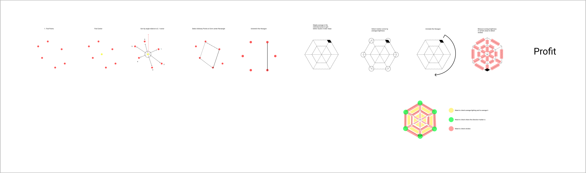

# Learning OpenCV 2

My idea today was to implement template matching.

But first i wanted to learn how to split my c++ program into multiple files for better organization.

This turned out to be a really bad rabbit hole, let me explain how importing other files works in javascript:

```js
import objectOrFunctionOrValue from "./modules/randomFile.js"

// Do something with the imported thing
```

In c++ land you have to be very explicit to your compiler so that works.

First of all there is a difference between Interface and Implementation in c++, those two things are split into `.ccp` _(Implementation)_ and `.hpp` _(Header / Interface)_ files. E.g.:

`createWebcam.hpp`

```hpp
VideoCapture createWebcam();
```

```cpp
VideoCapture createWebcam(){
	// ... create camera object
	retur object;
}
```

The second huge difference is that c++ does not really work with paths relative to the file in which you are importing from. Its works more like you tell the compiler a bunch of folders with stuff you want to import header files (`.hpp`) from. 
Then you `#include` the header files you want to import with a path relative to the folders which you included. E.g. i included the `scanner` folder, so when i want to import the `webcam.hpp` module I have to reference it by `modules/webcam.hpp`. 
But dont be fooled into thinking that the compiler automatically also includes the implementation files. Oh no, you have to include these yourself.

Then you also have to tell all that information to your language server, so your ide does not constantly complain that it doesnt find the files. For this you can use a tool called `bear` which automatically converts your compile command into a `compile_commands.json` which contains all the info for your ide.

The compile command looks like this btw:

```bash
g++ scanner.cpp modules/webcam.cpp -o main -I/home/jim/COCO/16_FunctionObjects/scanner/ $(pkg-config --cflags --libs opencv4) && ./main
```

The `$(pkg-config ...)` part is another program which helps you include the necessary libraries.

Some more information can be found [here](https://earthly.dev/blog/g++-makefile/)

_So, an hour later i am still no closer to my goal of template matching._

Later today i continued designing an idea on how to scan the sigils.

;
