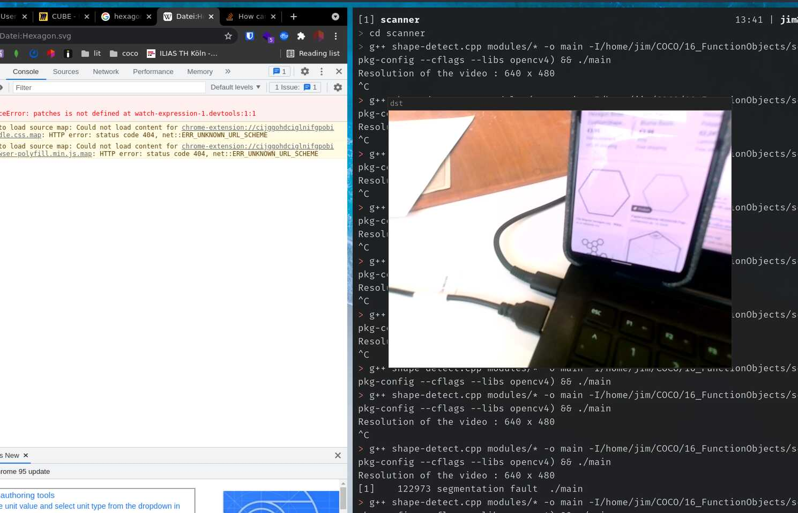
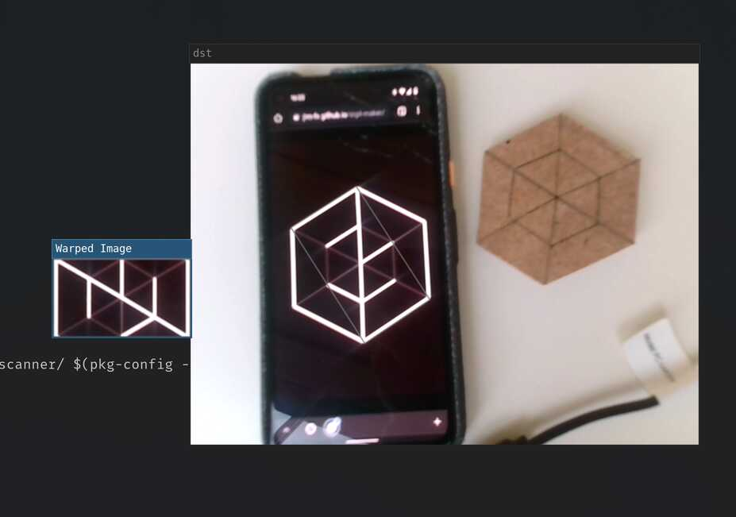

# 03 Learning OpenCV

Well this took already longer than expected. But i made a lot of progress today.

First of all pattern matching does not work for this type of problem.

Secondly the allgorithm i designed yesterday was a good starting point, but i sort of forgot a few steps before the beginning.

