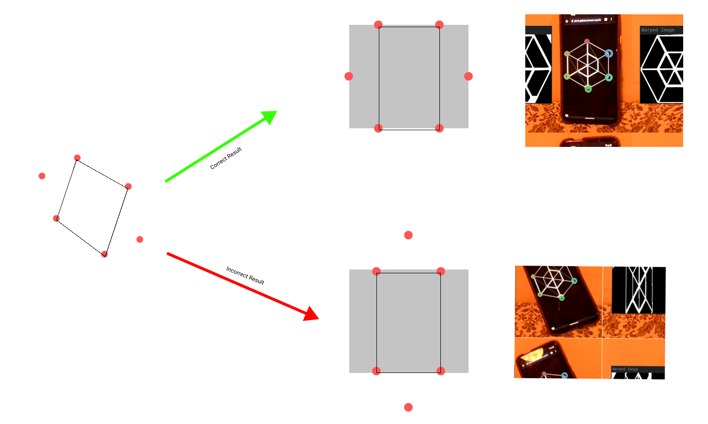

# 04 Fixing Bugs


Today I want to fix a nasty bug. They code all in all was working nicely, but sometimes the unprojected output image would be totally distorted.

_(2 Hours later)_ Aaand I fixed it :)



They code to fix the issue is relatively simple:

```c++

  Point2f src_[] = {
      Point2f(ordered_pts[0].x, ordered_pts[0].y),
      Point2f(ordered_pts[1].x, ordered_pts[1].y),
      Point2f(ordered_pts[2].x, ordered_pts[2].y),
      Point2f(ordered_pts[3].x, ordered_pts[3].y),
  };

 if (mw > mh) {
    src_[0] = Point2f(ordered_pts[3].x, ordered_pts[3].y);
    src_[1] = Point2f(ordered_pts[0].x, ordered_pts[0].y);
    src_[2] = Point2f(ordered_pts[1].x, ordered_pts[1].y);
    src_[3] = Point2f(ordered_pts[2].x, ordered_pts[2].y);
  }
```

`mw` is the largest of the first set of parallel lines in the rectangle and `mb` is the largest of the second set of parallel lines in the rectangle. If one parallel group is longer than the other the point array which creates the rectangle gets shifted by one position.

## Next Steps:

The next step is to implement the detection of the marker and the correction of the rotation of the image.
